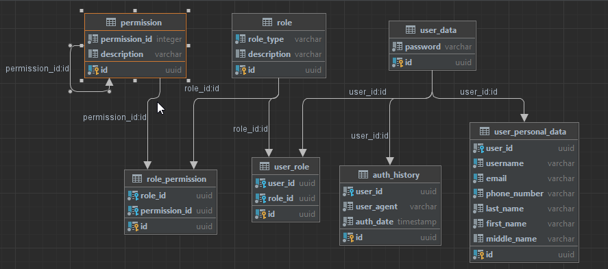

# Auth_sprint_1-2
Сервис авторизации

Миграция локально
-

1) python -m flask init
2) python -m flask migrate
3) python -m flask upgrade

Инфрастуктура
-
Flask доступен по адресу http://127.0.0.1:80  
Доступен один эндпоинт /hello-world  
PostgreSQL доступна снаружи для разработки временно

Таблицы
-
#### users
    id UUID
    username String
    password String
#### auth_history
    id UUID
    user_id UUID
    user_agent String
    auth_date TIMESTAMP
#### user_personal_data  
    id UUID
    user_id UUID
    email String
#### role  
    id UUID
    role_type String
    description String
#### permission  
    id UUID
    permission_id Integer
    description String
#### role_permission  
    id UUID
    role_id UUID
    permission_id UUID
#### user_role
    id UUID
    user_id UUID
    user_id UUID

