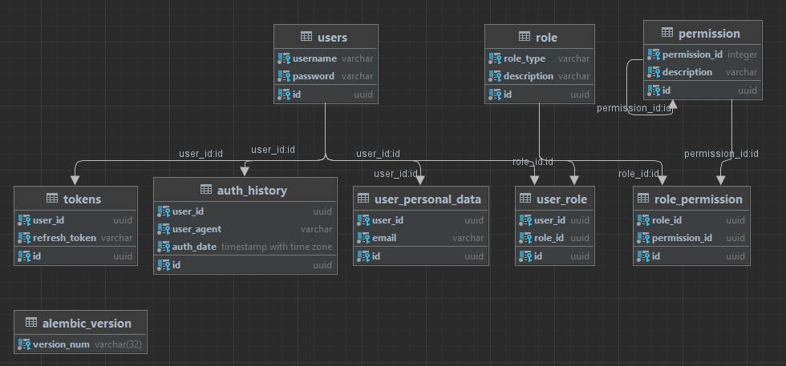

# Auth_sprint_1-2
Сервис авторизации

Комманды для запуска проекта
-
*Первый запуск*  

**make first_start**
- Применяет миграции  
flask init  
flask migrate  
flask upgrade  

Все комманды make  

**make help**

Миграция локально
-

1) python -m flask init
2) python -m flask migrate
3) python -m flask upgrade

CLI комманды
-
flask adm-cmd create-superuser "yourusername" "yourpassword"

Инфрастуктура
-
Flask доступен по адресу http://127.0.0.1:80/  
Документация http://127.0.0.1:80/doc/     
API http://127.0.0.1:80/api/v1/  
Jaeger http://127.0.0.1:16686/

Таблицы
-
#### users
    id UUID
    username String
    password String
#### auth_history
    id UUID
    user_id UUID
    user_agent String
    auth_date DateTime
#### user_personal_data  
    id UUID
    user_id UUID
    email String
#### role  
    id UUID
    role_type String
    description String
#### permission  
    id UUID
    permission_id Integer
    description String
#### role_permission  
    id UUID
    role_id UUID
    permission_id UUID
#### user_role
    id UUID
    user_id UUID
    user_id UUID
### tokens
    id UUID
    user_id UUID
    refresh_token String

